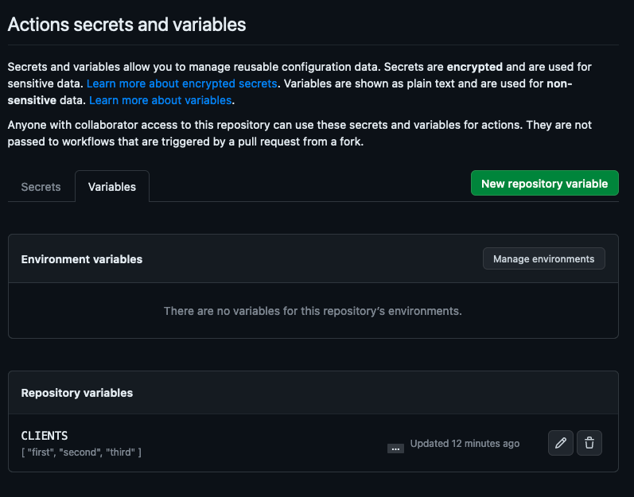
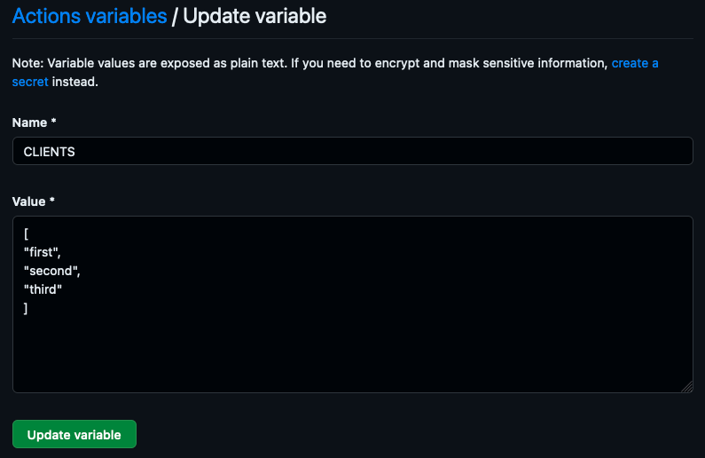
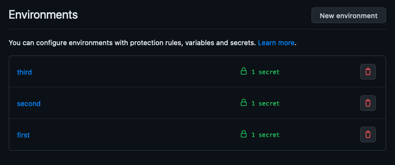

# GHA Matrix Testing

A simple repo to demonstrate how you can configure GitHub actions to run the same workflow across multiple environments
dynamically.

## TLDR?

* [Use a matrix in a single workflow with a dependent job](./.github/workflows/demo.yml)
* Use a matrix in a reusable workflow with a dependent job [caller workflow (parent)](./.github/workflows/demo_parent.yml)/[called workflow (child)](./.github/workflows/demo_child.yml)

## Repository configuration

Create a repo level environment variable that is a JSON array for each "client" we will deploy to:

Then create an environment for each client and add the required configuration:

Note for the case of this example the only configuration is a single secret, but this secret must exist in all
environments (or a default at the repo level).

Then create the workflow.

This repo includes an [example](./.github/workflows/demo.yml) that has a single job that is required ***before*** deployment
(a compile style step) but there could be 0 or many depending on your requirements. The core is then to define a job that
uses the repository environment variable as the jobs matrix. You can then use that name to pick an environment. This pattern
could be expanded if you wanted to by making the JSON more complex e.g. you may want multiple environments per client.

This repo also includes an example of how to make use of a matrix build when working with reusable workflows. See the [caller workflow (parent)](./.github/workflows/demo_parent.yml) and [called workflow (child)](./.github/workflows/demo_child.yml). This in particular can be unintuitive as discussed in [runner issue #1490](https://github.com/actions/runner/issues/1490) due to the need to "pass" in secrets to the child. These are looked up based on
the environment the child is running in and you should think of the declaration to pass in the secret as a mechanism of allowing the child to use that secret. Any secrets you don't explicitly "pass" into the child it can not lookup when it runs. For more information refer to the [encrypted secrets GitHub documentation](https://docs.github.com/en/actions/security-guides/encrypted-secrets#using-encrypted-secrets-in-a-workflow)

## Why?

Looking for a mechanism to deploy the same deployable to multiple clients without needing to change the yaml
configuration for every client or duplicate code.
